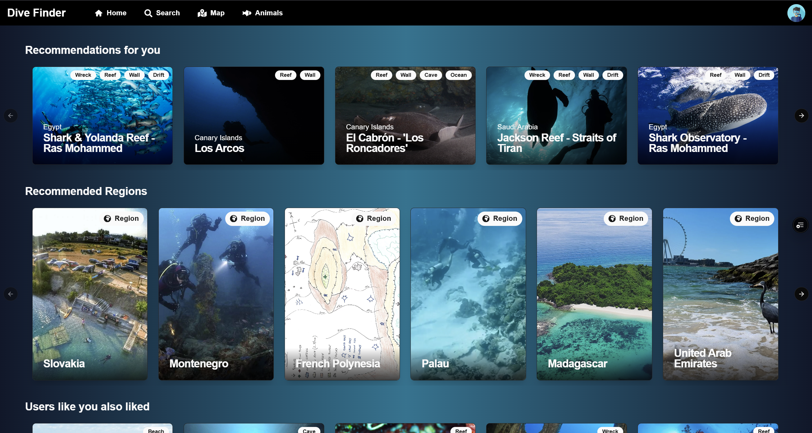
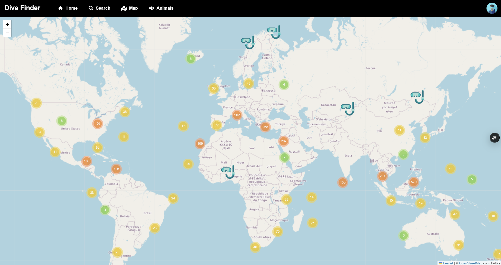
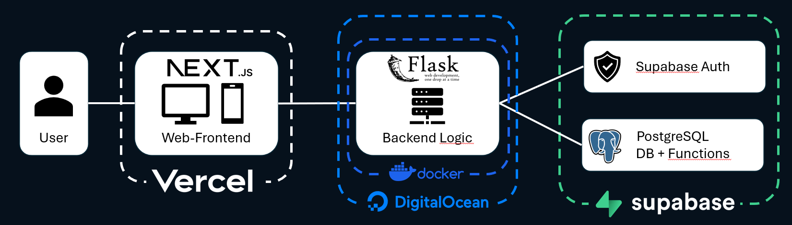

# Dive Finder

Dive Finder is a **recommendation system** designed to help scuba divers discover new dive sites tailored to their preferences. By analyzing various factors such as dive site categories, geographical data, and animal sightings, Dive Finder provides personalized suggestions to enhance your diving experiences.

For recommendations the app utilizes **content based filtering** and the **latent factor model**.





## Project Structure

The project is organized as follows:

- **analysis**: Includes source data, scripts and notebooks for data analysis and preprocessing.
- **backend**: Contains the server-side code, including the recommendation algorithms and database interactions.
- **models**: Contains data models and database schemas.
- **frontend**: Contains the client-side application build with Next.js

## IT Infrastructure



In order to run the frontend and backend of the application, environment variables for supabase in both the frontend and backend folder need to be in place:

```toml
NEXT_PUBLIC_SUPABASE_URL=https://...
NEXT_PUBLIC_SUPABASE_ANON_KEY=...
DATABASE_URI=postgresql://postgres...#only necessary in the backend folder
```
